# iOSFirebaseTools

```
    ███████╗██╗██████╗ ███████╗██████╗  █████╗ ███████╗███████╗
    ██╔════╝██║██╔══██╗██╔════╝██╔══██╗██╔══██╗██╔════╝██╔════╝
    █████╗  ██║██████╔╝█████╗  ██████╔╝███████║███████╗█████╗  
    ██╔══╝  ██║██╔══██╗██╔══╝  ██╔══██╗██╔══██║╚════██║██╔══╝  
    ██║     ██║██║  ██║███████╗██████╔╝██║  ██║███████║███████╗
    ╚═╝     ╚═╝╚═╝  ╚═╝╚══════╝╚═════╝ ╚═╝  ╚═╝╚══════╝╚══════╝
                                                                
         ████████╗ ██████╗  ██████╗ ██╗     ███████╗            
            ██║   ██╔═══██╗██╔═══██╗██║     ██╔════╝            
            ██║   ██║   ██║██║   ██║██║     ███████╗            
            ██║   ██║   ██║██║   ██║██║     ╚════██║            
            ██║   ╚██████╔╝╚██████╔╝███████╗███████║            
            ╚═╝    ╚═════╝  ╚═════╝ ╚══════╝╚══════╝            
                                                                
                🔥 iOS Firebase Integration Toolkit 🔥
```

<div align="center">

[](https://github.com/muhittincamdali/iOSFirebaseTools/actions/workflows/ci.yml)
[](https://swift.org)
[](https://developer.apple.com/ios/)
[](https://firebase.google.com)
[](https://swift.org/package-manager/)
[](LICENSE)

**Production-ready Firebase wrappers for iOS • Clean APIs • Type-safe • Battle-tested**

[Features](#-features) • [Quick Start](#-quick-start) • [Services](#-firebase-services) • [Examples](#-code-examples) • [Docs](#-documentation)

</div>

---

## 📋 Table of Contents

- [Overview](#-overview)
- [Features](#-features)
- [Quick Start](#-quick-start)
- [Firebase Services](#-firebase-services)
- [Code Examples](#-code-examples)
- [Documentation](#-documentation)
- [Contributing](#contributing)
- [License](#license)
- [Star History](#-star-history)

---

## 🎯 Overview

**iOSFirebaseTools** provides a clean, Swift-native abstraction layer over Firebase SDK. Instead of dealing with Firebase's verbose APIs, you get simple, chainable interfaces that feel like native Swift.

```swift
// Before: Firebase SDK
Auth.auth().signIn(withEmail: email, password: password) { result, error in
    if let error = error {
        // handle error
    }
    guard let user = result?.user else { return }
    // use user
}

// After: iOSFirebaseTools
FireAuth.signIn(email: email, password: password)
    .onSuccess { user in print("Welcome \(user.displayName)") }
    .onError { error in print(error.localizedDescription) }
```

---

## ✨ Features

- 🔐 **Unified Auth** — Email, Google, Apple, Phone auth with single API
- 📦 **Firestore ORM** — Codable models mapped directly to documents
- 📁 **Storage Helpers** — Upload/download with progress tracking
- 💥 **Crashlytics+** — Custom keys, logs, and non-fatal reporting
- 📊 **Analytics DSL** — Type-safe event logging
- 🎛️ **Remote Config** — Fetch & activate with defaults
- ⚡ **Cloud Functions** — Callable functions with typed responses
- 🔄 **Combine Support** — Publishers for reactive streams
- 🧪 **Testable** — Protocol-based for easy mocking

---

## 📋 Firebase Services Matrix

| Service | Status | Features |
|---------|--------|----------|
| **Authentication** | ✅ Full | Email, Google, Apple, Phone, Anonymous, Link accounts |
| **Cloud Firestore** | ✅ Full | CRUD, Queries, Real-time listeners, Codable mapping |
| **Cloud Storage** | ✅ Full | Upload, Download, Progress, Metadata, Delete |
| **Crashlytics** | ✅ Full | Crash reports, Custom keys, Logs, Non-fatals |
| **Analytics** | ✅ Full | Events, User properties, Screen tracking |
| **Remote Config** | ✅ Full | Fetch, Activate, Defaults, Real-time updates |
| **Cloud Functions** | ✅ Full | HTTPS callable, Typed request/response |
| **Performance** | 🔶 Partial | Custom traces, HTTP metrics |
| **Cloud Messaging** | 🔶 Partial | Token management, Topic subscription |

---

## 🏗️ Architecture

```mermaid
graph TB
    subgraph App["📱 Your App"]
        UI[SwiftUI / UIKit]
        VM[ViewModels]
    end
    
    subgraph FT["🔥 iOSFirebaseTools"]
        FA[FireAuth]
        FS[FireStore]
        FST[FireStorage]
        FC[FireCrash]
        FAN[FireAnalytics]
        FRC[FireConfig]
        FF[FireFunctions]
    end
    
    subgraph Firebase["☁️ Firebase SDK"]
        AUTH[Auth]
        STORE[Firestore]
        STORAGE[Storage]
        CRASH[Crashlytics]
        ANALYTICS[Analytics]
        CONFIG[RemoteConfig]
        FUNCTIONS[Functions]
    end
    
    UI --> VM
    VM --> FA
    VM --> FS
    VM --> FST
    VM --> FAN
    
    FA --> AUTH
    FS --> STORE
    FST --> STORAGE
    FC --> CRASH
    FAN --> ANALYTICS
    FRC --> CONFIG
    FF --> FUNCTIONS
    
    style FT fill:#FFCA28,stroke:#F57C00,color:#000
    style Firebase fill:#1976D2,stroke:#0D47A1,color:#fff
```



---

## 🚀 Quick Start

### Installation

**Swift Package Manager**

```swift
dependencies: [
    .package(url: "https://github.com/muhittincamdali/iOSFirebaseTools.git", from: "1.0.0")
]
```

### Setup

1. Add `GoogleService-Info.plist` to your project
2. Initialize in `AppDelegate` or `@main`:

```swift
import iOSFirebaseTools

@main
struct MyApp: App {
    init() {
        FirebaseToolsManager.configure()
    }
    
    var body: some Scene {
        WindowGroup {
            ContentView()
        }
    }
}
```

---

## 📖 Code Examples

### 🔐 Authentication

```swift
// Email sign in
let user = try await FireAuth.signIn(email: "user@example.com", password: "secret")

// Google sign in
let user = try await FireAuth.signInWithGoogle(presenting: viewController)

// Apple sign in
let user = try await FireAuth.signInWithApple()

// Phone auth
try await FireAuth.verifyPhone("+1234567890")
let user = try await FireAuth.confirmCode("123456")

// Sign out
try FireAuth.signOut()

// Auth state listener
FireAuth.onAuthStateChanged { user in
    if let user = user {
        print("Signed in: \(user.uid)")
    } else {
        print("Signed out")
    }
}
```

### 📦 Cloud Firestore

```swift
// Define your model
struct User: FirestoreDocument {
    @DocumentID var id: String?
    var name: String
    var email: String
    var createdAt: Date
}

// Create
let user = User(name: "John", email: "john@example.com", createdAt: Date())
try await FireStore.collection("users").add(user)

// Read
let user: User = try await FireStore.collection("users").document("abc123").get()

// Query
let users: [User] = try await FireStore.collection("users")
    .whereField("age", isGreaterThan: 21)
    .order(by: "createdAt", descending: true)
    .limit(to: 10)
    .get()

// Real-time listener
FireStore.collection("users").document("abc123")
    .listen { (user: User) in
        print("User updated: \(user.name)")
    }

// Batch write
let batch = FireStore.batch()
batch.set(user1, in: "users")
batch.update(["status": "active"], in: "users/abc123")
batch.delete("users/xyz789")
try await batch.commit()
```

### 📁 Cloud Storage

```swift
// Upload image
let url = try await FireStorage.upload(
    data: imageData,
    path: "avatars/\(userId).jpg",
    onProgress: { progress in
        print("Upload: \(Int(progress * 100))%")
    }
)

// Download
let data = try await FireStorage.download(path: "avatars/user123.jpg")

// Get download URL
let url = try await FireStorage.downloadURL(path: "documents/report.pdf")

// Delete
try await FireStorage.delete(path: "temp/old-file.txt")
```

### 💥 Crashlytics

```swift
// Set user identifier
FireCrash.setUserID("user_12345")

// Custom keys
FireCrash.setCustomValue("premium", forKey: "subscription_type")
FireCrash.setCustomValue(3, forKey: "items_in_cart")

// Breadcrumb logs
FireCrash.log("User tapped checkout button")

// Record non-fatal
FireCrash.record(error: PaymentError.cardDeclined)

// Record with extra context
FireCrash.record(
    error: NetworkError.timeout,
    userInfo: ["endpoint": "/api/users", "attempt": 3]
)
```

### 📊 Analytics

```swift
// Log events
FireAnalytics.log(.screenView(screenName: "Home", screenClass: "HomeViewController"))
FireAnalytics.log(.selectContent(contentType: "product", itemId: "SKU123"))
FireAnalytics.log(.purchase(currency: "USD", value: 29.99, items: purchaseItems))

// Custom events
FireAnalytics.log("level_completed", parameters: [
    "level": 5,
    "score": 12500,
    "time_seconds": 45
])

// User properties
FireAnalytics.setUserProperty("premium", forName: "subscription_status")

// Set user ID
FireAnalytics.setUserID("user_12345")
```

### 🎛️ Remote Config

```swift
// Set defaults
FireConfig.setDefaults([
    "welcome_message": "Hello!",
    "feature_enabled": false,
    "max_items": 10
])

// Fetch and activate
try await FireConfig.fetchAndActivate()

// Read values
let message: String = FireConfig["welcome_message"]
let isEnabled: Bool = FireConfig["feature_enabled"]
let maxItems: Int = FireConfig["max_items"]

// Real-time updates
FireConfig.addOnConfigUpdateListener { config in
    print("Config updated!")
    config.activate()
}
```

### ⚡ Cloud Functions

```swift
// Define request/response
struct AddMessageRequest: Encodable {
    let text: String
    let pushToUsers: [String]
}

struct AddMessageResponse: Decodable {
    let messageId: String
    let timestamp: Date
}

// Call function
let request = AddMessageRequest(text: "Hello!", pushToUsers: ["user1", "user2"])
let response: AddMessageResponse = try await FireFunctions.call("addMessage", with: request)
print("Created message: \(response.messageId)")
```

---

## 🔄 Combine Support

All async operations have Combine publishers:

```swift
import Combine

var cancellables = Set<AnyCancellable>()

// Auth state as publisher
FireAuth.authStatePublisher
    .sink { user in
        self.currentUser = user
    }
    .store(in: &cancellables)

// Firestore document as publisher
FireStore.collection("users").document("abc123")
    .publisher(as: User.self)
    .sink { user in
        self.user = user
    }
    .store(in: &cancellables)
```

---

## 🧪 Testing

All services conform to protocols for easy mocking:

```swift
// In tests
class MockFireAuth: FireAuthProtocol {
    var mockUser: User?
    
    func signIn(email: String, password: String) async throws -> User {
        guard let user = mockUser else {
            throw AuthError.userNotFound
        }
        return user
    }
}

// Inject mock
let viewModel = LoginViewModel(auth: MockFireAuth())
```

---

## 📚 Documentation

| Document | Description |
|----------|-------------|
| [Setup Guide](Documentation/Setup.md) | Initial configuration |
| [Authentication](Documentation/Authentication.md) | All auth methods |
| [Firestore](Documentation/Firestore.md) | Database operations |
| [Storage](Documentation/Storage.md) | File upload/download |
| [Analytics](Documentation/Analytics.md) | Event tracking |
| [Crashlytics](Documentation/Crashlytics.md) | Crash reporting |
| [Remote Config](Documentation/RemoteConfig.md) | Feature flags |
| [Functions](Documentation/Functions.md) | Cloud functions |

---

## 📋 Requirements

| Requirement | Minimum |
|-------------|---------|
| iOS | 15.0+ |
| Swift | 5.9+ |
| Xcode | 15.0+ |
| Firebase iOS SDK | 10.0+ |

---

## 🤝 Contributing

1. Fork the repository
2. Create feature branch (`git checkout -b feature/amazing`)
3. Commit changes (`git commit -m 'Add amazing feature'`)
4. Push to branch (`git push origin feature/amazing`)
5. Open Pull Request

See [CONTRIBUTING.md](CONTRIBUTING.md) for guidelines.

---

## 📄 License

MIT License - see [LICENSE](LICENSE) for details.

---

<div align="center">

**Built with 🔥 for the iOS community**

[](https://github.com/muhittincamdali/iOSFirebaseTools)

</div>

---

## 📈 Star History

<a href="https://star-history.com/#muhittincamdali/iOSFirebaseTools&Date">
 <picture>
   <source media="(prefers-color-scheme: dark)" srcset="https://api.star-history.com/svg?repos=muhittincamdali/iOSFirebaseTools&type=Date&theme=dark" />
   <source media="(prefers-color-scheme: light)" srcset="https://api.star-history.com/svg?repos=muhittincamdali/iOSFirebaseTools&type=Date" />
   
 </picture>
</a>
